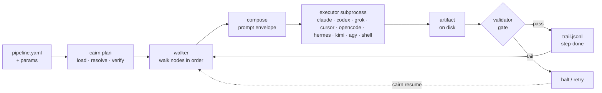

# cairn

**Artifact-native pipelines over coding-agent CLIs.**

[](https://www.python.org/)
[](LICENSE)
<!-- Post-publish badge (uncomment once cairn-pipelines is on PyPI):
[](https://pypi.org/project/cairn-pipelines/) -->

> A cairn is a stack of stones travelers leave to mark a trail. Every step of a cairn pipeline
> leaves a validated artifact on disk; the trail of artifacts *is* the execution state. Resume means
> walking the trail to the last valid cairn. Nothing else remembers anything.

cairn is a small, declarative orchestrator for **multi-phase agentic pipelines that delegate work to
coding-agent CLIs** — Claude Code, Codex, Grok — as headless subprocesses. It solves the problem you
hit the moment a pipeline outgrows a single chat session: **where is this run, and is each step
actually done?** cairn's answer is the filesystem. Every step writes a typed artifact validated by
JSON Schema plus optional Python checks; an append-only JSONL trail records every event; and resume
is just walking the run directory to the last valid artifact and re-running from there. There is no
database, no checkpointer, and no in-memory session to lose — `kill -9` at any moment costs you at
most one step's work.

Pipelines are declared in YAML and don't know which CLI runs them. A step names an abstract worker;
the CLI behind it is a swappable **executor**, and different steps of one run can use different ones
(a "mixed fleet"). The kernel is stdlib plus two dependencies (`pyyaml`, `jsonschema`) and everything
runs through [`uv`](https://docs.astral.sh/uv/).

---

## Quick start

Under five minutes to your first run. cairn needs Python ≥ 3.11 and `uv`.

**Install from source** (the path today):

```bash
git clone https://github.com/gabros20/cairn && cd cairn
uv tool install .          # installs the `cairn` command on your PATH
```

> [!NOTE]
> Prefer not to install globally? Run it in place from a clone with `uv run cairn <args>` — every
> `cairn` command below works the same way with that prefix.

**Install from PyPI** (the post-publish path):

```bash
uv tool install cairn-pipelines   # distribution: cairn-pipelines · command + import package: cairn
```

The package publishes to PyPI as **`cairn-pipelines`** (the name `cairn` was already taken there),
but the command you run and the Python package you import are both **`cairn`**.

**Scaffold a workspace and run the day-0 pipeline** — it needs no auth, no API key, and no model,
because it's built from deterministic `run:` steps plus one gate:

```bash
cairn new workspace demo --dir .   # creates ./demo (--dir is the PARENT directory)
cd demo
cairn plan hello                   # static-verify params, dataflow, schemas — zero tokens
cairn run hello --headless         # writes runs/hello-world-<date>/
cairn trail runs/hello-world-*     # replay what happened, step by step
```

You'll get a run directory with a `greeting.json` and a `message.txt` artifact, a `gates/tone.json`
decision, and a `trail.jsonl` recording every event. That's the whole model in miniature — nothing
about it changes when the steps become real coding-agent invocations.

## How it works

A pipeline is a declarative *trail* of nodes. `cairn plan` type-checks it into an execution plan
without spending a token; the walker then drives each node. For an agent step, it renders a prompt
envelope to a file, invokes one fresh executor subprocess, and only marks the step **done** if the
artifacts it produced pass their validators. Every event lands in `trail.jsonl`, and `cairn resume`
re-walks from the first step whose artifact no longer validates.



The orchestrator is deterministic code; only the *inside* of a step is model-driven. Pipelines use
exactly five node kinds — **step** (a delegation), **gate** (a human decision, written to disk as an
artifact), **parallel** (a concurrent group), **loop** (a bounded review⇄revise cycle), and
**manual** (a checkable by-hand step). See [`docs/ARCHITECTURE.md`](docs/ARCHITECTURE.md) for the
full execution semantics.

### A scaffolded workspace

`cairn new workspace` gives you a complete, runnable workspace — the unit you `git clone` to
reproduce a whole pipeline system:

```
demo/
├── cairn.toml              # workspace config: executors, model tiers, defaults, [tools] preflight
├── pipelines/              # the trails — ordered, declarative steps
│   ├── hello.yaml          #   day-0 pipeline: run: steps + one gate, no auth needed
│   └── self-improve.yaml   #   the learning loop: aggregate → curate → gate → PR
├── agents/                 # worker declarations (tier · effort · skills · tools), not CLI bindings
├── skills/                 # markdown capability packs, inlined into agent envelopes
│   └── cairn-operator/     #   how a coding agent drives cairn (ships in every workspace)
├── schemas/                # artifact + return JSON Schemas
├── validators/             # pure acceptance checks (exit 0/1 + machine-readable reasons)
├── scripts/                # deterministic helpers that run: steps call
├── prompts/DOCTRINE.md     # doctrine inlined into every agent envelope
├── tests/                  # `cairn test` furniture: fixtures, stub replays, the pipeline matrix
├── allowlist.yaml          # named command fragments agents are permitted to run
└── runs/                   # created on first run — every execution, self-describing (gitignored)
```

### A run directory

Each execution is one self-describing directory — the isolation boundary, the resume source of
truth, and a complete post-mortem with no external service (abridged — omits internal bookkeeping
like `.cairn/` and the lock file):

```
runs/hello-world-<date>/
├── run.json               # pinned: params, dims, executor(s), resolved models, pipeline hash
├── trail.jsonl            # append-only event log: run-start · step-done · gate-answered · run-done
├── greeting.json          # a produced artifact (schema-validated)
├── message.txt            # a produced artifact (validator-checked)
├── gates/
│   └── tone.json          # the gate decision, stored as an artifact — replayable, never re-asked
└── logs/
    ├── greet.prompt.md    # the EXACT rendered envelope — the prompt is an artifact too
    └── greet.log          # step stdout/stderr
```

## Why cairn

cairn keeps the one good idea in graph frameworks — *topology as data* — and drops everything else
they sell, because the filesystem already does it better for this class of system. Honest positioning:

| Instead of… | The tension | Where cairn sits |
|---|---|---|
| **LangGraph**-style graph frameworks | its checkpointer DB and your artifacts become two competing authorities on "where is this run?" | one authority — the validated filesystem |
| **CI runners** (GitHub Actions…) | right skeleton (declarative steps, artifacts) but no agent envelope, no gates-as-data, no validation edges, and cloud-shaped | the same skeleton, built around headless agent processes and local run dirs |
| **Staying inside one agent CLI** | orchestration gets welded to that one vendor's subagent/workflow primitives | pipelines are portable; the CLI is a swappable executor |

The design principles it enforces: the filesystem is the state machine; agents are fresh processes,
not shared sessions; contracts (typed artifacts) over parsed conversation; determinism is validated,
not trusted; humans are first-class steps (gates); and a small, dependency-light core with a
declarative surface. The long form is in [`docs/README.md`](docs/README.md) and
[`docs/CONCEPTS.md`](docs/CONCEPTS.md).

## Command reference

Every verb from `cairn --help`:

| Command | Does |
|---|---|
| `cairn plan <pipeline>` | Resolve params, expand conditionals, statically verify dataflow/schemas/agents/skills, and print the execution plan. No run. |
| `cairn run <pipeline>` | Plan, then execute. `--executor codex` picks a fleet; `--step-executor review=claude` mixes them; `--headless` for CI/batch. |
| `cairn resume <run-dir>` | Re-plan against recorded params and walk from the first invalid step. Re-running *is* the retry mechanism. |
| `cairn gate <run-dir> <name>=<choice>` | Answer a pending gate out-of-band; refuses to overwrite an already-answered one. |
| `cairn validate <run-dir> [artifact]` | Re-run validators ad-hoc over a run's produced artifacts. |
| `cairn trail <run-dir>` | Read a run's trail as a status tree; `--follow --json` streams NDJSON. |
| `cairn ps` | Cross-run fleet view (running / gate-waiting / halted). No daemon. |
| `cairn doctor` | Preflight every executor (auth, version, hook support) plus workspace lint. |
| `cairn test [suite]` | The offline L1 suites (validators/guards/pipelines/envelopes); `cairn test record <run-dir>` harvests a real run into fixtures. |
| `cairn new <kind> <name>` | Scaffold a `workspace`, `pipeline`, `agent`, `skill`, or `validator`. |
| `cairn compose <pipeline> <step>` | Render a step's envelope to stdout without executing it — the AX previewer. |
| `cairn batch <pipeline>` | Run a pipeline over every line of a JSONL params file, in parallel run dirs. |
| `cairn learnings` | Aggregate `learn` events across all runs. |
| `cairn gc` | Retention over the runs root (dry-run unless `--apply`). |
| `cairn schedule <install\|list\|run\|uninstall>` | Sync `schedules.yaml` into the host scheduler (cron/launchd/systemd). |
| `cairn trigger <sync\|list\|remove\|run>` | Sync `triggers.yaml` into the host watcher (launchd/systemd); `run <name>` drains one trigger's inbox now. |

## Executors

An executor is the only CLI-aware code in the system — a plugin binding an abstract worker to a real
subprocess. The first five are live-verified end-to-end; the five newest are adapter-complete
(flag surfaces sourced from vendor docs and local `--help` probes, unit-tested against fake
binaries) with a real-CLI smoke run still pending:

| Executor | Runs | Status |
|---|---|---|
| `shell` | a deterministic command — how `run:` steps execute | Live. Even determinism goes through the executor interface. |
| `stub` | recorded envelopes replayed from fixtures | Live. Powers offline pipeline tests through production code, zero tokens. |
| `claude` | `claude -p` (Claude Code) | Live-verified; first real run captured as an offline stub regression. |
| `codex` | `codex exec` | Live-verified; same. |
| `grok` | `grok --prompt-file` | Live-verified; same. A mixed fleet spanning codex → claude → grok has run end-to-end. |
| `cursor` | `agent -p` (Cursor CLI) | Adapter-complete; smoke pending. Uses cursor's own sandbox (`--sandbox enabled`), codex-style. |
| `opencode` | `opencode run` | Adapter-complete; smoke pending. Flags probed against a local opencode 1.17.15. |
| `hermes` | `hermes -z` (Nous Research) | Adapter-complete; smoke pending. Flags probed against a local install. |
| `kimi` | `kimi -p` (Kimi Code / K3) | Adapter-complete; smoke pending. Model + effort ride a per-run generated `KIMI_CODE_HOME` config. |
| `agy` | `agy -p` (Antigravity / Gemini) | Adapter-complete; smoke pending. **Local-only**: auth is interactive OS-keyring sign-in — no API-key/CI path exists (Google-confirmed), doctor errors actionably. |

`cursor`/`opencode`/`hermes`/`kimi`/`agy` headless modes auto-approve with no native approval gate
(cursor excepted — it ships its own sandbox), so `opencode`/`hermes`/`kimi`/`agy` run under cairn's
OS filesystem sandbox (`sandbox: fs`), the same containment claude gets.

## Documentation

The design package lives in [`docs/`](docs/). Start with the getting-started tutorial, then the
docs index.

| Doc | What |
|---|---|
| [GETTING-STARTED](docs/GETTING-STARTED.md) | Hands-on tutorial: from `cairn new` to your first agent step. |
| [README (docs index)](docs/README.md) | Vision, philosophy, and positioning vs LangGraph / CI / staying in one CLI. |
| [CONCEPTS](docs/CONCEPTS.md) | The noun/verb model — every moving part and its one place. |
| [ARCHITECTURE](docs/ARCHITECTURE.md) | Kernel layout, execution semantics, guards, extension points. |
| [API](docs/API.md) | File formats, template language, the Executor protocol, CLI reference. |
| [EXAMPLE-BREASE-REBUILD](docs/EXAMPLE-BREASE-REBUILD.md) | The real six-phase pipeline expressed in full — the proof the abstraction covers it. |
| [TOOLING-AND-GROWTH](docs/TOOLING-AND-GROWTH.md) | How external tools enter a pipeline, the maturation ladder, the learning loop. |
| [IMPLEMENTATION-PLAN](docs/IMPLEMENTATION-PLAN.md) | Build milestones (C0–C7), each independently verifiable. |
| [DISTRIBUTION](docs/DISTRIBUTION.md) | Packaging, versioning surfaces, the scaffold, the operator skill. |
| [TESTING](docs/TESTING.md) | The validation pyramid, the stub executor, fixtures, envelope snapshots. |
| [OBSERVABILITY](docs/OBSERVABILITY.md) | The Trail Protocol, sinks, OTel mapping, `cairn ps`. |
| [SECURITY](docs/SECURITY.md) | The secrets contract, prompt-injection posture, budgets. |
| [SCHEDULING](docs/SCHEDULING.md) | First-class scheduling without a resident scheduler. |

## Status

**v0.5.0 released; 1137 tests passing.** The kernel and all ten executors are built and green
(claude/codex/grok live-verified; cursor/opencode/hermes/kimi/agy adapter-complete, smoke pending),
scheduling / batch / learnings / gc have shipped, and the hardening backlog is in (heartbeat trail
events, a webhook sink, kernel-side secret redaction, cross-version resume gates, tool enforcement,
one aware-UTC clock). The self-improve pipeline ships as scaffold furniture — the framework provides
the mechanism, the workspace owns the policy.

**Done (2026-07-04):** brease-factory (see Lineage) now runs as cairn's first real workspace — its
`v2` branch is a three-pipeline workspace (clone / redesign / reimagine tracks) on cairn ≥0.3, and
its migration findings drove the 0.3.0 flexibility fixes. Its CMS-population branch stays gated on
the separate Brease CLI. **Deferred:** the live parity benchmark (native v1 vs cairn v2 on the same
site). See [`docs/IMPLEMENTATION-PLAN.md`](docs/IMPLEMENTATION-PLAN.md) and
[CHANGELOG.md](CHANGELOG.md).

## Lineage

cairn was distilled from a working system, not invented in the abstract. It comes from
brease-factory — a six-phase website-rebuild pipeline (capture → audit → blueprint → CMS → frontend
→ QA) built natively on Claude Code skills, subagents, hooks, and typed artifact gates. Every concept
in cairn exists because that pipeline needed it.

The bridge was a porting study that asked: *how do we run that pipeline on Codex and Grok too, not
just Claude?* Its answer — an external driver calling each CLI headlessly, once per phase, through a
thin adapter, with artifacts as the interface — is exactly what cairn generalizes. The driver became
the kernel, the adapter became the Executor protocol, and the port milestones became the
implementation plan. In one line: the pipeline architecture that survived contact with reality, made
reusable — one orchestrator, any coding-agent CLI, every run a legible trail on disk.

## License

MIT — see [LICENSE](LICENSE).
