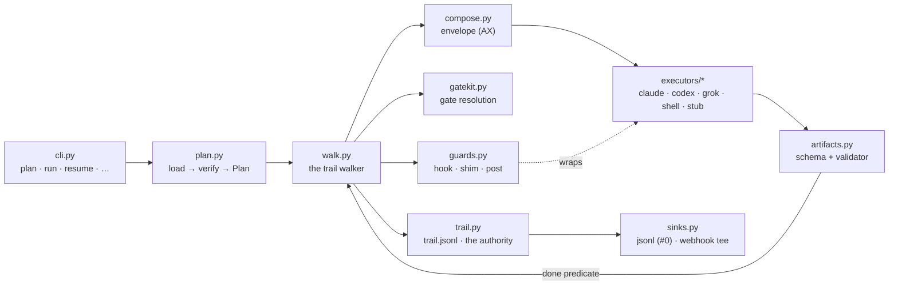
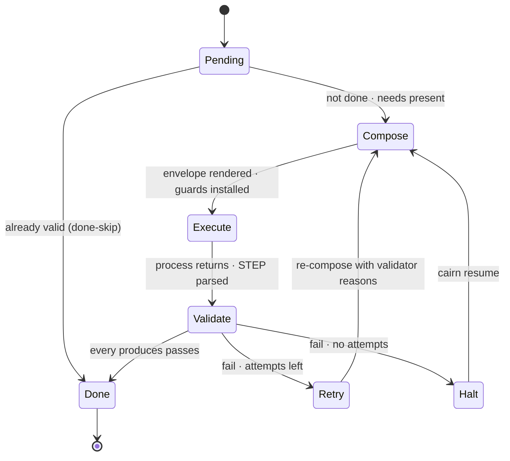

# cairn — Architecture

How the kernel is built and exactly how execution behaves. Companion to `CONCEPTS.md` (the model)
and `API.md` (the formats). Design constraint throughout: **a small, dependency-light kernel —
stdlib + `pyyaml` + `jsonschema` only; everything else is a plugin.** (With the hardening backlog in,
the kernel sits on the order of ~9,000 lines across roughly two dozen modules — several times the
initial ~2,500-line aspiration, but the two-dependency floor and the plugin boundary held.)

---

## 1. Layers

```
┌────────────────────────────────────────────────────────────────┐
│ CLI  plan·run·resume·gate·validate·trail·ps·doctor·test·new…   │
├────────────────────────────────────────────────────────────────┤
│ KERNEL                                                          │
│  plan.py      load → resolve → expand → verify → Plan           │
│  walk.py      the trail walker (run/resume/halt; loop/parallel) │
│  compose.py   the prompt envelope (AX)                          │
│  artifacts.py naming, globbing, schema+validator evaluation     │
│  gatekit.py   gate resolution (TTY built-in; UIs pluggable)     │
│  guards.py    enforcement engine (hook/shim/post per executor)  │
│  trail.py     event log read/write; status derivation           │
│  + support:   config · expr · template · runstate · types ·     │
│               errors · doctor · newkit · testkit · schemas      │
├────────────────────────────────────────────────────────────────┤
│ EXECUTORS (plugins)  claude·codex·grok·shell·stub · (yours)     │
├────────────────────────────────────────────────────────────────┤
│ WORKSPACE (data)      pipelines/ agents/ skills/ schemas/       │
│                       validators/ guards/ prompts/ cairn.toml   │
├────────────────────────────────────────────────────────────────┤
│ RUNS (state)          runs/<id>/ — the only mutable layer       │
└────────────────────────────────────────────────────────────────┘
```

Dependency rule: **downward only.** Executors never read pipelines; the kernel never contains a CLI
name; the workspace is immutable during a run; all mutation lands in exactly one run dir.

The same picture as a control flow — how a `cairn run` moves through the kernel modules, and where
the guard engine sits relative to the executor it wraps:



`plan.py` produces a static `Plan`; `walk.py` executes it, composing an envelope per step
(`compose.py`), resolving gates (`gatekit.py`), installing guards (`guards.py`), invoking a fresh
process (`executors/*`), and gating on artifact validity (`artifacts.py`) before appending to the
trail (`trail.py`) and teeing to any sinks (`sinks.py`).

## 2. Planning — `cairn plan`

Planning is a pure function: `(workspace, pipeline, params) → Plan | ConfigError`. Steps:

1. **Load & schema-check** `pipeline.yaml`, all referenced `agents/*.yaml`, `cairn.toml`.
2. **Resolve params** (types, defaults, required) → derive **dims** via the pipeline's preset table.
3. **Expand conditionals**: evaluate every `when:`/`unless:` that depends only on params/dims now;
   ones referencing artifact content stay as runtime predicates on the node.
4. **Verify dataflow**: walk nodes in order, tracking the set of produced artifact names. Any `needs`
   not in the set ⇒ `ConfigError` naming the step, the artifact, and the candidate producers. Any
   artifact produced twice (outside a loop) ⇒ error. Unused artifacts ⇒ warning.
5. **Verify references**: every agent file, skill dir, schema file, validator, guard checker exists;
   every expression parses; every tier is mapped for the chosen executor(s).
6. **Emit the Plan**: an ordered list of concrete nodes with resolved agent specs, executor
   assignment (global `--executor` + per-step overrides), model resolution, timeouts.

`plan` failing fast with file+line diagnostics *is* the DX headline: the entire class of "phase 4
crashed because phase 2's output name was typo'd" dies before a single token is spent.

## 3. Walking — the execution semantics

The walker consumes the Plan against a run dir. Per node kind:

### 3.1 `step`
```
1. done? → skip.           done(step) ⇔ ∀ a ∈ produces: exists(a) ∧ validate(a) = pass
2. needs check             ∀ a ∈ needs: done-produced or fail ConfigError (can't happen post-plan
                           except human deletion — checked anyway; disk is authority)
3. compose envelope        → runs/<id>/logs/<step>[.rN][.cK].prompt.md   (§6)
4. install guards          shims onto PATH; env: CAIRN_RUN_DIR, CAIRN_STEP, CLAUDE_PROJECT_DIR…
5. executor.invoke()       fresh process, cwd = run dir, timeout, stdout/stderr → logs/<step>.log
6. parse STEP return       sentinel-framed JSON (§7); artifact validity is authority over it
7. validate produces       each artifact: schema then validator
8. record                  trail: done{step, artifacts, metrics} · run.json phase status
   on fail                 → retry? (attempts left: re-compose WITH validator reasons; goto 3)
                           → else halt (§3.5)
```

The same lifecycle as a state machine — note that *validate* is the only gate to *done*, and that
`cairn resume` re-enters a halted step at *compose*, never trusting a hand-edited artifact (§3.5):



### 3.2 `gate`
Resolved decision at `gates/<name>.json`? → skip (this is what makes gates resumable and *never
re-asked*). Otherwise: a `--gate name=choice` preset resolves it (`by:"flag"`); interactive →
render question + artifact summary via the gate UI plugin (TTY default, `by:"tty"`); headless →
write the declared `default` (`by:"default"`). A `default` is **mandatory at plan time** (a gate
without one is a config error), so a headless run always resolves every gate and never blocks on
one. Either way the decision file is written first, then the trail `gate-answered` event. **No
model is ever mid-conversation during a gate** — gates live *between* processes.

### 3.3 `parallel`
`ThreadPoolExecutor(len(steps))` — each child step is its own OS process anyway; threads only
supervise. Group is done when all children are done. Failure policy `on_fail: wait_all | fast`
(default `wait_all`: let siblings finish, then halt — half-finished sibling artifacts remain valid
and resumable). Children must have disjoint `produces` (plan-time check).

### 3.4 `loop`
```
cycle = 1 + count(existing valid cycle artifacts)     # state derived from disk, nothing else
while cycle ≤ max[mode]:
    run body steps with {cycle} bound (artifact paths, prompts, expressions)
    if cycle ≥ min and eval(until): break
    cycle += 1
at cap without `until`: trail `loop-capped` + declared `on_cap: halt | continue` (brease art-review
uses continue — residual punch-list is recorded, pipeline proceeds to QA)
```
Loop state = which `…-r{cycle}` artifacts exist and validate. A resumed run recomputes the cycle
from disk — no counters stored anywhere.

### 3.5 Halt & resume
`halt` = trail event with `{node, reason, validator_reasons[], exit_code}`, partial artifacts left
in place, process exits with a distinct code (§9). **Resume is the retry mechanism:** `cairn resume`
re-plans with the recorded params (warning on pipeline content-hash drift, `--force` to accept),
then walks; every done node skips, the first not-done node re-executes. If the halt was a validator
failure and the step declares `retry.feedback`, the failed attempt's reasons are already in the
trail and get injected into the recomposed envelope.

**Operator note — don't hand-fix a halted step's artifact.** A node halted on validation is recorded
`halted`, and on resume a recorded halt outranks the artifact predicate: the step **re-runs and will
overwrite** any artifact a human edited in place, so the hand-fix is silently lost. The supported
path is to fix the *inputs* — the workspace, the upstream artifacts, or the step's config — and let
the step regenerate its output. (Answering an operator-blocked `manual`/`gate` out of band is the
one sanctioned by-hand action, because those halt as needs-human, not as a validation failure.)

### 3.6 `manual`
Print instructions + the validation criterion, wait for Enter (headless: halt with "requires
operator"), then validate `produces` like any step.

## 4. Guard enforcement matrix

Guards declare `enforce:` layers; the engine wires what each executor supports and *always* keeps
`post` on. `enforce:` is **validated at plan time** (codex-F13/claude-F10, W3b): every member must be
one of `plan.GUARD_LAYERS = ("hook", "shim", "post")` and the list must be non-empty — an unknown
member (a typo like `shimm`) or an empty `enforce: []` is a `ConfigError` naming the guard and the bad
value, not a silent no-op. This catches the *spelling* class of "declared but not actually enforced";
see below for the *no executor actually enforces it* class, which is a warning, not an error.

| Layer | Claude | Codex | Grok | shell |
|---|---|---|---|---|
| `hook` (native pre-tool block) | PreToolUse deny-JSON | PreToolUse deny-JSON *(hooks.json; fires headless — probe-verified on dev machine)* | PreToolUse deny-JSON or exit 2 *(grok 0.2.82; fires headless — probe-verified on dev machine)* | n/a |
| `shim` (PATH wrapper) | ✓ | ✓ | ✓ | ✓ |
| `post` (validator backstop) | ✓ | ✓ | ✓ | ✓ |

*Status: **`shim` + `post` enforce on a live run today.** `post` (the validator backstop) is the
walker's hard artifact gate, always on. `shim` is live too: for any plan carrying `shim`-enforced
guards, `cairn run`/`resume` builds a fresh per-run shim dir (`.cairn/shims`, via
`guards.build_shims`) and wraps every executor in a `GuardedExecutor` that prepends that dir to each
invocation's PATH (`cli.py:_wrap_guards`), so a guarded, PATH-resolved binary is intercepted before it
runs — independent of the hook layer. The `hook` layer now **installs for `claude`**:
`ClaudeExecutor.install_guards` writes `<run_dir>/.claude/settings.json` with a `PreToolUse` array whose
hook command runs `guards.py`'s `--hook-check` entry — the SAME guard chain (`_run_chain`) the shims run,
so a `hook`-enforced guard blocks a guarded `Bash` command before it executes (deny-JSON on stdout;
fail-closed on any error). A plan with no `hook`-enforced guards installs nothing. **`codex` and `grok`
install remain no-ops** — their `install_guards` does not yet wire native hooks, so for those two a
guarded command is still caught by the shim and the post validator, not by a native hook. (The
`--hook-check` install path is unit-tested; the live "claude actually blocks" fact is confirmed
per-machine by `cairn doctor --probe-hooks`, not by the unit suite.)*

*`Capabilities` now separates two facts that used to be conflated in one field (grok-F3 / W3b):
`blocking_hooks` is the CLI-capability/probe question — "can this vendor's CLI block a tool call via a
native hook at all" (`claude`=`True`, an asserted claim the C4 probe checks; `codex`/`grok`=`None`,
unverified-by-cairn → the doctor probe decides); `installs_hooks` is the IMPLEMENTATION fact — "does
cairn's own `install_guards` for this executor actually wire that hook for a run" (`claude`=`True`,
`codex`/`grok`/`shell`/`stub`=`False`). Grok's CLI genuinely ships blocking PreToolUse hooks (see the
probe note below) but cairn doesn't install one for it, so asserting `blocking_hooks=True` there was
dishonest about what THIS FRAMEWORK does — it now reads `None`, same as codex. **`plan()` warns** (never
errors — an under-enforced guard is a legitimate, if risky, authoring choice) when a guard's `enforce`
yields no EFFECTIVE pre-execution layer for the plan's resolved executor(s): effective iff
`"shim" in enforce` (always wired, for EVERY executor — the shim dir is prepended to PATH regardless of
which executor(s) the plan resolves) OR (`"hook" in enforce` AND **every** executor the plan resolves has
`installs_hooks=True`). The `hook` check is deliberately per-executor, not "some resolved executor
installs hooks": a plan mixing `claude` and `codex` steps has hook coverage for the claude steps only, so
a plan-wide "some executor installs hooks" verdict would silently hide a codex step's guarded command
going unblocked. When coverage is partial, the warning names exactly which resolved executor(s) lack it
— `guard 'no-deploy': enforce=('hook',) but executor(s) {'codex'} do not install hooks — the command is
NOT blocked before it runs under them; only the post validator applies` — so `claude`+`codex`+`hook`-only
warns naming `codex` even though `claude` IS covered, and `claude`-only never warns. A `post`-only guard
warns under any executor set. Separately, a plan with agent steps and **zero** guards at all gets one
informational warning that agent tool use is unrestricted pre-execution.*

*Both the shim and hook manifests (the guard decls a command is checked against) live OUTSIDE the run
dir in the gatekeys-protected state dir and are **authenticated**: a per-run HMAC over the manifest
content plus a sha256 of each check script, keyed by the run secret held outside the agent's write
scope (`gatekeys`). A sandboxed executor (codex `--sandbox workspace-write`) therefore cannot rewrite
the policy — the manifest is not in its cwd; and even under claude `bypassPermissions` (whole-FS write)
a rewritten manifest or a swapped check script **fails verification and denies** (fail-closed) unless
the agent also steals the run secret. What the `hook` does NOT do is widen the matcher: it uses the
SAME `fnmatch` glob as the shim, so an absolute-path / `sh -c` / `env`-prefixed / leading-space
invocation of a guarded binary MISSES the glob and is caught only by `post` — the hook does **not**
backstop the shim's absolute-path gap (corrected: earlier text claimed it did). Closing the claude
`bypassPermissions` residual outright (an OS FS-sandbox or tool-scoping so claude cannot read the run
secret or write outside the run dir) is tracked as **W3c**.*

**The C4 probe settles a specific burden.** The `claude` executor runs headless with
`--permission-mode bypassPermissions` (it must — see API §7 / SECURITY §1.2: the default mode refuses
every tool use and the guards are the enforcement layer instead of an interactive prompt). That made
`Capabilities.blocking_hooks = True` an **asserted design claim** whose whole containment story depends
on PreToolUse hooks *still firing AND still blocking* (exit 2) even under `bypassPermissions`. The C4
doctor hook-probe (`cairn doctor --probe-hooks`) now confirms exactly that empirically — and on the
dev machine it does: `claude` PreToolUse **fires+blocks** under `bypassPermissions`, so this open risk
is falsified where probed. `bypassPermissions` bypasses the interactive prompt but does **not** disable
hooks. This is a per-machine, per-CLI-version fact, not a universal guarantee: treat
`blocking_hooks=True` as the design's assumption and the probe as the standing per-machine check that
confirms it. (Codex's and, since W3b, grok's `blocking_hooks` both stay `None` in code by design — the
probe, not the capability field, carries their per-machine truth. Grok's CLI probes hook-primary just
like claude's — see below — but cairn's `install_guards` doesn't wire it, so `blocking_hooks=True`
would have overstated what *this framework* enforces; `installs_hooks=False` says that honestly and
`None` leaves the CLI-capability question to the probe, exactly as codex already did.)

`cairn doctor --probe-hooks` empirically probes hook firing per executor — it spawns a throwaway canary
project carrying a native deny-hook, invokes the vendor CLI headlessly under the executor's real argv
posture and the walker's exact env baseline, and classifies the outcome (fires+blocks / fires-not-blocks
/ no-fire / inconclusive) — so the port design's highest risk becomes a diagnosed, per-machine fact instead
of an assumption. On the dev machine all three vendor executors probe **hook-primary**: `claude`,
`codex` (codex-cli 0.142.5 *does* ship native PreToolUse blocking hooks), and `grok` (grok 0.2.82:
PreToolUse fires+blocks under `bypassPermissions`). One posture caveat is grok-specific: a grok hook
denies only via `{"decision":"deny"}` on stdout (honored regardless of exit code) or exit 2 — **every
other hook failure (crash, timeout, malformed output) fails OPEN**, so for grok the shim and `post`
layers are the backstop against a broken hook, not just a bypassed one. The check script contract is
one file, one convention (exit 0/2), reused across all three layers.

**Guard activation — runtime `when` (C9).** A `guards:` entry may carry a `when:`. A plan-time `when`
(references only `params`/`dims`) is settled by the planner: an inactive guard is dropped entirely,
before it ever reaches a run. A **runtime** `when` (references `gates`/`artifacts`/`run`/`cycle`) can't
be settled until mid-run, so it is evaluated by the **walker**, per invocation, against trusted
in-memory state (`self.plan.params/dims`, the W2-verified gate reader, the W6-contained artifact
resolver) — never by the subprocess, and never re-read from the agent-writable `run.json`. The walker
writes a fresh, per-invocation SIGNED manifest (same `write_manifest`/MAC machinery as the static
install, keyed by step+cycle so `parallel:` children never share a path) containing only the
CURRENTLY-active guards, and points that invocation's `CAIRN_SHIM_MANIFEST`/`CAIRN_HOOK_MANIFEST` at it
(env-first: the static once-per-run manifest is the fallback when no guard has a runtime `when`, which
is the common case and costs nothing extra). The shim/hook decision path (`_run_chain`) is completely
unaware of any of this — an inactive guard is simply absent from the manifest it loads, which it
already treats as "skip". A guard whose `when` can't evaluate (e.g. a referenced gate/artifact is
missing) is treated ACTIVE, never dropped — full design and rationale in `GUARD-WHEN-PLAN.md`.

## 5. Isolation & environment

Each invocation gets: `cwd = run dir`; env `CAIRN_RUN_DIR`, `CAIRN_STEP`, `CAIRN_WORKSPACE`
(+ `CLAUDE_PROJECT_DIR` for compat) — **per-process env, no global pointer file**, so N concurrent
runs are safe by construction; the executor's own sandbox flags (`--sandbox workspace-write`,
`--cwd`, permission mode) from its config; the guard shims prepended to PATH. The envelope states
the isolation rule and the wrong-run tripwire (assert `run.json.params.url` matches) — belt over
the environment's suspenders, unchanged from today.

**Config isolation per CLI (W4).** Each executor also seals its process from *ambient user
config*, so identical pipeline runs are deterministic regardless of the operator's local
`~/.claude`, `$CODEX_HOME/config.toml`, or `~/.grok` state:
- **claude**: `--setting-sources project` loads only the run-dir `.claude/settings.json`
  (the "project" source) that `install_guards` writes — the cairn guard hook stays authoritative
  while the user's `~/.claude/settings.json` is dropped; `--strict-mcp-config` drops any ambient
  MCP servers. The prompt itself rides on stdin, not argv (`-p`/`--print` without the positional
  `prompt` arg reads stdin) — keeps the envelope off `ps`/`/proc/*/cmdline` and off the
  `MAX_ARG_STRLEN` ceiling. `--no-session-persistence` disables the on-disk session transcript
  entirely, so `Capabilities.session_capture` is `None` (there is nothing to capture).
- **codex**: `--ignore-user-config` skips `$CODEX_HOME/config.toml` (auth still uses
  `CODEX_HOME`); `--ignore-rules` skips user/project execpolicy `.rules` files; `--ephemeral`
  (W5b) runs without persisting session files to disk, so `Capabilities.session_capture` is
  `None` — the old `~/.codex/sessions/**` glob was dead, nothing ever consumed it.
- **grok**: `--no-memory` disables cross-session memory; `--sandbox workspace` applies the
  built-in `workspace` sandbox profile (read everywhere, write only cwd + `~/.grok/` + temp
  dirs) — the workspace-write equivalent to codex's `--sandbox workspace-write`.

**Network policy (W5b, codex-F5).** An agent's `tools.network` (API.md §3) resolves through
`StepNode.network` (plan.py) into `Invocation.network` — parsed since plan.py existed but never
reached an executor until this field was added. **codex** consumes it: `-c
sandbox_workspace_write.network_access=true|false`, emitted on every invocation (not only
under `network: true`) so a step's `false` is stated explicitly rather than left to the
sandbox's undeclared default. **grok**'s `--sandbox <PROFILE>` is a single profile governing
filesystem AND network together, with no separate toggle to verify against the captured
`--help` (and no enumerated profile roster to pick an alternate one from); **claude**'s CLI has
no analogous flag. Both leave `inv.network` unconsumed on purpose rather than invent an
unverified flag — future work, tracked in each adapter (`cairn/executors/{grok,claude}.py`).

**Doctor drift checks (W5b, codex-F19/grok-F14/claude-F15).** `cairn doctor` re-verifies two
things per in-scope executor, both WARN-level and never a reason to fail the doctor exit: (1)
**flag presence** — each adapter declares a small `_emitted_flags` const (the flags/tokens its
`_build_command` can emit); doctor greps the installed CLI's `--help` (`codex exec --help` for
codex) for each as a whole token, and warns by name on a miss (e.g. "claude --setting-sources
not advertised by installed claude"); (2) **model validation** — grok's configured tier models
are checked against `grok models`' live roster; claude's against the alias set
(opus/sonnet/haiku/fable) plus the dated-id shape; codex has no queryable model roster, so
nothing is checked (documented, not silent). A help-fetch failure is one warning, never a crash
and never a false positive per flag. The doctor version probe itself is also hardened: a
bad-shim/ENOEXEC binary that `shutil.which` resolves but that fails to spawn raises
`ExecutorSpawnError` (a `CairnError`, post-W1) — caught into a clean Finding, mirroring the
`cli.py` fix from W5a.

## 6. The envelope — AX as a specification

`compose.py` renders **the same six blocks, in the same order, for every agent step on every
executor**, to a file that is part of the run record:

```
1 MISSION    you are <agent> executing <step> of <pipeline> · run dir (absolute) · tripwire
2 CONTRACT   inputs: each `needs` artifact — absolute path + one-line description
             outputs: each `produces` — absolute path + schema path + acceptance criteria text
             (+ on retry: "previous attempt failed validation: <reasons>")
3 SKILLS     full SKILL.md bodies for the agent's skills (deterministic inlining, §CONCEPTS.7)
4 TRAIL      last N trail events + top-K learnings (the read-before brief)
5 DOCTRINE   the workspace doctrine slice (isolation, invariants, guard notice)
6 RETURN     the STEP protocol (§7) + "your final message is data, not prose"
```

AX principles, enforceable because composition is code:
- **Absolute paths, always.** No agent ever resolves a relative path.
- **Contract over instruction.** Acceptance criteria are copied from the artifact declarations —
  the agent reads the same text the validator enforces.
- **Nothing hidden.** If it isn't in the envelope or at a declared path, it doesn't exist. No
  reliance on any CLI's auto-context.
- **Schemas are readable.** The envelope points at schema files the agent can open — models produce
  dramatically better JSON when shown the schema.
- **Failure is informative.** Retries carry validator reasons verbatim; the agent never guesses
  what was wrong.
- **One job.** One step, one contract, one return. Anything bigger is the pipeline's job.

## 7. The STEP return protocol

Final-message contract, executor-independent. (Codex's native `--output-schema` is *reserved* as a
future bonus where available, never relied on — the built CodexExecutor does not wire it yet; the
sentinel block below is the sole contract on every executor today.)

```
<<<STEP
{ "status": "done | skipped | blocked",
  "summary": "one paragraph",
  "artifacts": ["captures/site-map.json", ...],
  "metrics":  { "pages": 19 },
  "learnings": [ { "note": "...", "tag": "capture" } ],
  "blockers":  [ "..." ] }
STEP>>>
```

Sentinel-framed so it survives chatty models. Parse policy (authority rule): artifacts valid +
STEP unparsable → warn, continue. Artifacts invalid → halt regardless of what STEP claims.
`status: skipped` + a skip reason is how self-skipping steps (asset-gen with no gap) record
themselves — trail `skip` event, `produces` exempted via `skippable: true`.

## 8. Batch & composition

`cairn batch` is **not a kernel concept**: it's a bounded process pool (`-j`) of independent
`cairn run` invocations, one params-set each, each in its own run dir. All gates resolve to
defaults (or `--gate scope=all` presets). The same recursion works upward: a `cairn run` is itself
one deterministic command, so a *different* pipeline — or an interactive agent session — can invoke
it as a tool. Composition happens above the pipeline, never inside a step.

## 9. Exit codes & failure taxonomy

| Code | Meaning | Typical actor response |
|---|---|---|
| 0 | run complete | — |
| 2 | config error (plan-time) | fix workspace file named in the error |
| 3 | artifact gate failed | read validator reasons → `cairn resume` |
| 4 | executor failure (spawn/auth/crash); also: run-lock contention (run is held by PID …) | `cairn doctor`, then resume |
| 5 | timeout | inspect `logs/<step>.log`, resume |
| 6 | needs a human: a `manual:` step in headless mode, or an interactive gate whose TTY was closed/interrupted (headless gates can't reach here — their `default` is mandatory) | answer externally (`cairn gate <run> <name>=<choice>`) or preset (`--gate`), then resume — the operator-pattern hook for coding agents |
| 7 | budget exceeded (`SECURITY.md` §4) | raise the cap or accept the partial run, then resume |

## 10. Reproducibility

`run.json` records: pipeline content-hash, workspace git rev + dirty flag (if any — `null` outside
a git repo or when `git` is unavailable), cairn version, executor versions (each resolved
executor's `--version`, probed once at mint; a probe failure records `null`, never a mint crash),
resolved model IDs per step (date-pinned where the vendor allows), params, dims. `cairn resume`
warns (never refuses) on drift in either the executor versions or the git rev — a newer CLI or a
workspace commit since mint doesn't invalidate what's already on disk, unlike a changed pipeline
(hash drift, refuses without `--force`) or a cross-major cairn version. Two runs with equal hashes
and params differ only by model nondeterminism — the maximum honesty possible in this domain.

Every node's `run.json` `at` is the REAL wall-clock transition time (`datetime.now(timezone.utc)`
at the moment the status is written), not the walk's construction-time clock — a multi-hour run's
`cairn ps` and post-mortems reflect when nodes actually finished, not all-at-second-zero. Path and
`{datetime}`-placeholder rendering still uses the walk's frozen clock, deliberately: that
determinism (the same run renders the same artifact paths on every resume) is a different
guarantee from an event timestamp's honesty, and the two must not be conflated.

## 11. Extension points (the pi-mono discipline)

Small kernel; five sanctioned plugin surfaces, each a tiny protocol + entry-point registration:

| Surface | Protocol | Built-ins | Examples of later plugins |
|---|---|---|---|
| **Executor** | 5 ops (`API.md §6`) | claude, codex, grok, shell, stub (test replay — `TESTING.md §5`) | cursor, opencode, raw-API |
| **Gate UI** | `ask(question, options, context) → choice` | TTY | web panel, Slack approval |
| **Trail sink** | `emit(event)` (tee — never authority; bounded retry, cannot slow a run) | jsonl, webhook | OTel exporter, Slack, desktop notify (`OBSERVABILITY.md` §2) |
| **Validator** | any executable, exit 0/1 + reasons | — | language-agnostic by design |
| **Guard check** | any executable, exit 0/2 + reason | — | same |

Nothing else is pluggable **on purpose** — node kinds, envelope block order, the STEP protocol, and
run-dir layout are fixed. That fixedness is what makes every cairn workspace legible to every tool
(and every agent) that has seen one before.

An Executor plugin's declared surface (`Capabilities`, the argv `_build_command` emits) is a
claim about the vendor CLI, and claims drift out from under a plugin author as the vendor ships
new releases. `cairn doctor` is the per-machine check on that claim (§5 above): it re-verifies a
plugin's emitted flags and configured models against the *installed* CLI, not just that the
binary runs — WARN-level, so a stale claim is surfaced without blocking the workspace.
