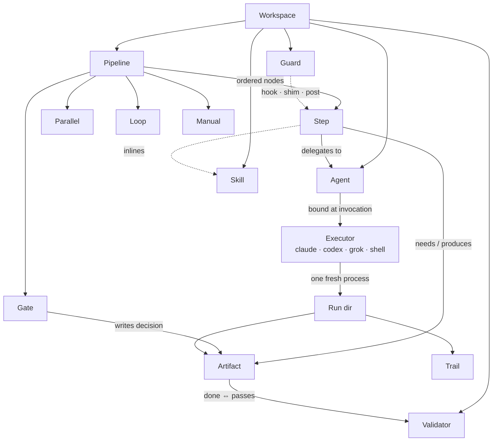

# cairn — Concepts

The complete noun/verb model. For each concept: what it is, where it lives, why it exists, and what
breaks without it. If a proposed feature doesn't strengthen one of these concepts, it doesn't go in
the kernel — it goes in a plugin or it doesn't go in at all.

## The model at a glance

Boxes are the nouns; edge labels are the verbs. Everything below is one of these parts, and every
part exists to serve one of these relationships — the whole of the kernel's vocabulary in one map.



Read it as sentences: a *pipeline* orders *steps* (and four other node kinds); a *step* delegates to
an *agent*, which binds an *executor* only at invocation; a step *produces* *artifacts* that are
*done* exactly when their *validator* passes; a *gate* writes its decision as an artifact too; a
*guard* wraps a step's commands; an *executor* runs as one fresh process inside a *run dir* whose
*trail* is the event log. The rest of this page is that map, one concept per section.

---

## 1. Workspace

**Is:** a directory that holds everything a family of pipelines needs — the unit of versioning and
sharing. brease-factory — the pipeline cairn was distilled from — became the first real workspace
(its `v2` branch, 2026-07-04).

```
my-factory/
├── cairn.toml               # workspace config: executors, tiers, defaults, doctrine path
├── pipelines/*.yaml         # the trails
├── agents/*.yaml            # the workers
├── skills/<name>/SKILL.md   # capability packs (+ references/ scripts/ assets/)
├── schemas/*.json           # artifact + return JSON Schemas
├── validators/*.py          # acceptance checks (pure, stdlib)
├── guards/*.py              # command policies
├── prompts/DOCTRINE.md      # workspace doctrine (+ optional envelope-block overrides)
└── runs/                    # every execution ever, self-describing
```

**Why:** one root to resolve every relative path against; one thing to `git clone` to reproduce a
whole pipeline system. **Without it:** paths and configs scatter per-CLI (exactly today's
`.claude/` weld).

## 2. Pipeline

**Is:** a declarative *trail* — an ordered list of nodes with exactly five kinds: **step**, **gate**,
**parallel**, **loop**, **manual**. Not a general DAG: order is explicit; the dependency graph is
*declared* through artifact `needs`/`produces` and **cross-checked** against the order at plan time
(a step consuming an artifact no earlier node produces is a config error before anything runs).

**Why "DAG in our terms":** analysis of the real pipeline cairn was distilled from showed the topology
is a sequence with three local deviations (a mid-phase gate, one concurrent pair, one bounded loop). Five
node kinds cover it with room to spare; generic edge-lists would buy nothing and cost static
verifiability. Order-explicit + dataflow-checked is strictly more auditable than order-inferred.

**Without it:** orchestration lives in prose (skill instructions) and gets re-implemented per
harness — today's exact disease.

## 3. Step

**Is:** one unit of delegation with a contract:

```yaml
- id: capture
  agent: site-extractor        # WHO (an agent declaration)
  args: { step: capture }      # parameterizes the skill/prompt
  needs: [discovery, scope]    # reads these artifacts (validated present before start)
  produces: [site-map, design-signals]   # done ⇔ these exist AND validate
  timeout: 45m
  retry: { attempts: 1, feedback: true } # optional; validator reasons fed into the retry prompt
```

Three execution kinds, one contract shape:
- `agent:` — one fresh headless CLI process (the normal case).
- `run:` — a deterministic script (`run: python scripts/discover_urls.py --select …`). **No LLM.**
  Same needs/produces/validation. This unifies Make-style mechanical steps and agentic steps under
  one model — the discovery-selection transform, screenshot capture, or a build command need no
  model and shouldn't pay for one.
- `manual:` — instructions printed to the operator, wait for confirmation, then validate (e.g.
  "run `brease login` in another terminal, press Enter"). Turns per-machine setup into a checkable
  pipeline node instead of a README paragraph.

**Why:** the step is where *who / with-what-knowledge / on-what-inputs / to-what-acceptable-outputs*
meet. **Without the contract:** you're back to trusting transcripts.

## 4. Artifact

**Is:** a named, typed file contract — declared once in the pipeline, referenced by name everywhere:

```yaml
artifacts:
  site-map:   { path: captures/site-map.json, schema: schemas/site-map.json, validator: validators/p0.py }
  blueprints: { path: blueprints/**,          validator: validators/p2.py }
  art-review: { path: qa/art-review-r{cycle}.json, schema: schemas/art-review.json }
```

Artifacts are **the edges of the graph**, the *done* predicate of every step, the resume mechanism,
and the audit record. Their JSON content is addressable in expressions
(`artifacts.art-review.verdict == 'approve'`), which is how loops exit and conditions read prior
results **without any state store** — the file *is* the state.

**Why first-class (not just paths in prompts):** naming + schema + validator in one place means the
plan can verify dataflow statically, the walker can compute done-ness, and agents get contracts
copied into their envelope verbatim. **Without it:** validation is ad-hoc per step and resume is
guesswork.

## 5. Agent

**Is:** a *worker declaration* — capability profile, not a CLI binding:

```yaml
# agents/site-extractor.yaml
tier: balanced                 # reasoning | balanced | cheap — abstract, resolved per executor
effort: medium
escalate: { when: "dims.design != 'reproduce'", tier: reasoning }
skills: [brease-capture-site, crawl4ai]
tools: { allow: [read, write, edit, bash], bash: allowlist.yaml#capture }
returns: schemas/step-return.json
```

Agents bind to executors only at invocation: the same `site-extractor` runs on Claude today, Codex
tomorrow, mixed within one run. Model *tiers* (not vendor names) keep the declaration portable;
`cairn.toml` maps tier → concrete model per executor.

**Why:** the 12 brease agents proved the shape (tier + effort + tools + skills + escalation) is the
complete worker spec. **Without abstraction:** model names fossilize into prompts and every executor
port re-edits every agent.

## 6. Executor

**Is:** the CLI binding — the *only* CLI-aware code in the system. A plugin implementing five
operations (spec: `API.md §6`): `doctor` (preflight), `resolve_model` (tier+effort → flags),
`invoke` (one headless process: prompt file in, artifacts + typed return out), `install_guards`
(wire native hooks where the CLI has them), `render_workspace` (emit AGENTS.md-style files if the
CLI wants them). Built-ins: `claude`, `codex`, `grok`, `shell` (which is how `run:` steps execute —
even determinism goes through the same interface).

**Capabilities are declared, not assumed** (`blocking_hooks`, `output_schema`, `session_capture`,
`installs_hooks`), and the guard engine adapts enforcement to them — and warns at plan time when a
guard's declared layer isn't actually backed by any resolved executor (ARCHITECTURE §4).

**Why:** this is the `CliAdapter` seam from cairn's originating port design verbatim — the boundary
both the Codex and Grok mappings independently demanded. **Without it:** N pipelines × M CLIs = N×M
ports. With it: N + M.

## 7. Skill

**Is:** a markdown capability pack — `SKILL.md` (+ `references/`, `scripts/`, `assets/`) — the
knowledge a worker needs to do a step well. Unchanged from today's format on purpose: it's already
the de-facto cross-CLI standard (Claude native, Grok reads it, Codex's format is isomorphic).

**cairn's one hard rule:** skills are **inlined deterministically** into the envelope by the
composer — never left to a CLI's auto-discovery in headless mode. Auto-load is a bonus in
interactive use, not a mechanism the pipeline depends on.

**Why:** knowledge versioned next to the pipeline, identical on every executor. **Without
deterministic inlining:** each CLI's headless loader quirks become correctness bugs.

## 8. Gate

**Is:** a human decision point as a first-class node. Reads declared artifacts, asks one question
(TTY by default; gate UIs are plugins — web/Slack later), writes the decision to
`runs/<id>/gates/<name>.json`, which downstream steps consume like any artifact.

```yaml
- gate: scope
  reads: [discovery]
  ask: "Which pages should we capture?"
  options: { recommended: "nav-linked core pages", all: "everything discovered", core: "home+core only" }
  default: all          # what a headless run resolves to (unconditional gate → always resolves)
```

**Why decisions-as-artifacts:** replayable (`cairn resume` never re-asks answered gates), auditable
(the run dir records who chose what), and headless-safe (defaults are declared, not improvised).
**Without it:** human input happens *inside* model context — unauditable, unresumable, and
impossible for CLIs without an AskUserQuestion equivalent (i.e., all of them headless).

## 9. Guard

**Is:** a pre-execution policy on commands, with declared enforcement layers:

```yaml
guards:
  - name: no-screenshot-media           # F18
    match: { tool: bash, command: "brease* createMedia*" }
    check: guards/f18.py                # exit 0 allow · exit 2 deny (stderr = reason)
    enforce: [hook, shim, post]         # defense in depth
    on_error: allow                     # fail-open (this guard's choice; fail-closed available)
```

`hook` = the executor's native pre-tool hook (Claude/Codex deny-JSON, Grok deny-JSON or exit 2 —
all three probe-verified fires+blocks on the dev machine, `doctor --probe-hooks`);
`shim` = a PATH wrapper the kernel installs into the step's environment (works on *any* CLI);
`post` = a validator that catches what slipped through, before the next step can consume it.

**Why:** the F18 lesson — "don't do X" in a prompt is not enforcement. **Without layered guards:**
the weakest CLI's hook support becomes the whole system's safety ceiling — the port design's top risk.

## 10. Validator

**Is:** a pure check — any executable, contract `argv: run_dir, artifact_name, artifact_path` → exit
0 or exit 1 with machine-readable reasons on stdout. Today's `validate-artifact.py` decomposes into these.

**Why pure and external:** validators are the *only* arbiter of done-ness, so they must be runnable
by the walker, by `cairn validate` ad-hoc, by a retry prompt (reasons are fed back verbatim), and in
CI — with zero framework coupling. **Without them:** "done" means "the model said so".

## 11. Run & Trail

**Is:** one execution = one directory (`runs/<slug>-…/`), fully self-describing: `run.json` (pinned
schema: params, dims, executor(s), resolved models, content-hash of the pipeline), `trail.jsonl`
(append-only events: `start · done · gate · halt · skip · learn`), `gates/`, `logs/<step>.log` +
`logs/<step>.prompt.md` (the **exact rendered envelope** — the prompt is an artifact too), and the
artifacts themselves.

**Why:** the run dir is the isolation boundary (never reads a sibling), the resume source of truth,
and a complete post-mortem without any external service. **Without the trail:** observability
requires a platform; with it, `tail -f` is the platform.

## 12. The verbs (CLI)

| Verb | Does |
|---|---|
| `cairn plan <pipeline>` | resolve params → expand conditionals → **static-verify** (dataflow, schemas, agents, skills exist) → print the execution plan. No run. |
| `cairn run <pipeline> --param k=v --executor codex` | plan + walk. `--step-executor review=claude` mixes fleets. |
| `cairn resume <run-dir> [--force]` | re-plan against the recorded params, walk from the first invalid step. **Re-running is the retry mechanism.** `--force` accepts pipeline-hash drift. |
| `cairn gate <run-dir> <name>=<choice>` | answer a pending gate out-of-band → writes `gates/<name>.json` (`by:"external"`). Validates the run, the gate, and the choice, and **refuses to overwrite an already-answered gate** — the operator-pattern hook. |
| `cairn validate <run-dir> [artifact]` | run validators ad-hoc over a run's done-step artifacts. |
| `cairn trail <run-dir> [--watch\|--follow --json]` | status tree from `trail.jsonl`; `--follow --json` is the NDJSON monitor stream. |
| `cairn ps [--json]` | cross-run fleet view (running / gate-waiting / halted), derived from `run.json` + trail recency. No daemon. |
| `cairn doctor [--executor …]` | preflight every executor (auth, version, hook support) + workspace lint. |
| `cairn compose <pipeline> <step>` | render a step's envelope to stdout without executing — the AX previewer. |
| `cairn test [suite] [--update]` · `cairn test record <run-dir>` | the offline L1 suites (validators/guards/pipelines/envelopes) + harvest a real run into fixtures (`TESTING.md`). |
| `cairn batch <pipeline> --params-file sites.jsonl -j 8` | outer process pool of `cairn run --headless`s — batch is *not* a kernel concept, just runs in parallel dirs. |
| `cairn learnings [--since] [--tag]` · `cairn gc [--apply]` · `cairn schedule install\|list\|run\|uninstall` | aggregate `learn` events across runs · retention (dry-run unless `--apply`) · sync `schedules.yaml` → host scheduler (`SCHEDULING.md`). |
| `cairn new workspace\|pipeline\|agent\|skill\|validator <name>` | scaffolding. |

---

## What deliberately has NO place

Named non-features, so they don't creep in:

- **No checkpointer / state DB** — the filesystem, validated, is strictly better for this class.
- **No message-passing between agents** — artifacts or nothing.
- **No dynamic topology** — a model cannot add nodes to a running pipeline. (It *can* be given a
  whole `cairn run` as a tool — composition happens above, not inside.)
- **No async runtime** — subprocess-bound work; threads for `parallel:` groups suffice.
- **No auto-retry loops beyond `retry: {attempts: N}`** — bounded, validator-fed, default 0.
- **No cloud service** — a run dir + `trail.jsonl` is the observability platform.
