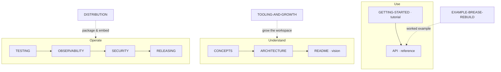

# cairn documentation

> **A cairn is a stack of stones travelers leave to mark a trail.** Every step of a cairn pipeline
> leaves a validated artifact on disk; the trail of artifacts *is* the execution state. Resume means
> walking the trail to the last valid cairn. Nothing else remembers anything.

This folder is the complete documentation set for cairn — a small, declarative orchestrator for
**multi-phase agentic pipelines that delegate work to coding-agent CLIs** (Claude Code, Codex, Grok, …)
as headless subprocesses, with **typed artifacts as the only interface between steps**.

The docs are organised by the [Diátaxis](https://diataxis.fr) framework — every page is one of a
**tutorial** (learning), a **how-to** (a task), **reference** (lookup), or **explanation**
(understanding). Find the mode that matches what you're trying to do; this file itself is the top-level
**explanation** — the index above the fold, the vision below it.

---

## Find your way

| Doc | Mode | Answers |
|---|---|---|
| **[GETTING-STARTED.md](GETTING-STARTED.md)** | Tutorial | *I've never seen cairn — walk me from install to a real run.* |
| **[API.md](API.md)** | Reference | *What's the exact syntax for `cairn.toml` / a pipeline / an agent / the CLI?* |
| **[CONCEPTS.md](CONCEPTS.md)** | Explanation | *What are the moving parts, and why does each exist?* |
| **[ARCHITECTURE.md](ARCHITECTURE.md)** | Explanation | *How is the kernel built and how does execution actually behave?* |
| **README.md** (this file) | Explanation | *Why does cairn exist, and why not LangGraph / CI / a vendor SDK?* |
| **[EXAMPLE-BREASE-REBUILD.md](EXAMPLE-BREASE-REBUILD.md)** | Worked example | *Show me a real, full-scale pipeline expressed in cairn.* |
| **[TESTING.md](TESTING.md)** | How-to + Explanation | *How do I test a workspace offline, and what does each test layer catch?* |
| **[OBSERVABILITY.md](OBSERVABILITY.md)** | How-to + Explanation | *How do I watch a run — the trail, webhooks, `cairn ps`, OTel?* |
| **[SECURITY.md](SECURITY.md)** | How-to + Explanation | *How do I handle secrets, untrusted content, blast radius, and budgets?* |
| **[SCHEDULING.md](SCHEDULING.md)** | How-to + Explanation | *How do I run a pipeline on a schedule without a daemon?* |
| **[TOOLING-AND-GROWTH.md](TOOLING-AND-GROWTH.md)** | How-to + Explanation | *How do external tools enter a pipeline, and how does a workspace mature?* |
| **[DISTRIBUTION.md](DISTRIBUTION.md)** | How-to + Explanation | *How is cairn packaged, versioned, and embedded in a coding agent?* |
| **RELEASING.md** | How-to | *How do we cut a release?* *(being written alongside this doc.)* |
| **[IMPLEMENTATION-PLAN.md](IMPLEMENTATION-PLAN.md)** | Historical record | *In what order was cairn built, and against what verifications?* |

The "How-to + Explanation" pages are labelled honestly: each opens by explaining a subsystem, then gives
the concrete recipes for operating it. If you want only the recipe, skip to that page's task sections.

### Reading paths

- **I want to *use* cairn** → the [repo README](../README.md) for the pitch → **[GETTING-STARTED.md](GETTING-STARTED.md)** for the first run → **[API.md](API.md)** when you need the exact shape of a file.
- **I want to *understand* it** → **[CONCEPTS.md](CONCEPTS.md)** (the noun/verb model) → **[ARCHITECTURE.md](ARCHITECTURE.md)** (execution semantics) → the vision below on this page (why these choices).
- **I want to *operate / contribute*** → **[TESTING.md](TESTING.md)** (prove a change offline) → **[OBSERVABILITY.md](OBSERVABILITY.md)** (watch it run) → **[SECURITY.md](SECURITY.md)** (contain it) → **RELEASING.md** (ship it).



---

# Why cairn exists

The rest of this page is the **explanation** doc — the reasoning behind the design. It is the same
vision that framed the project; the reference and how-to pages above turn it into detail.

## Why not LangGraph / Sandcastle / CI

We evaluated the alternatives seriously:

| | Orchestrates | State model | Agents are | Verdict for our problem |
|---|---|---|---|---|
| **LangGraph** | in-process LLM graphs | checkpointer DB (competes with disk) | SDK calls sharing message state | Wrong layer. Its checkpointer and our artifacts would be two authorities on "where is this run?" — a bug class our design structurally lacks. |
| **Sandcastle** | agent CLI subprocesses | git branches merged back | code-editing sessions | Right layer, wrong center of gravity: built for *edit-code-and-merge*; our agents are *artifact generators in run dirs*. We'd use it with its core feature off. |
| **CI runners** (GH Actions…) | shell jobs | opaque per-job workspaces | not a concept | Right skeleton (declarative steps, artifacts) but no agent envelope, no gates-as-data, no validation edges, cloud-shaped. |
| **Claude Code native** (the origin) | skills + Workflow JS | artifacts (ours) + session | subagents (one vendor) | What we generalized away from: the orchestration was welded to one CLI's primitives. |
| **cairn** | agent CLI subprocesses | **the filesystem, validated** | fresh headless processes | Every concept below exists because a real pipeline needed it; nothing else got in. |

The one good idea in graph frameworks — *topology as data* — we keep. Everything else they sell
(checkpointers, interrupts, streaming state) our filesystem already does better for this class of
system.

## The philosophy (enforced by a framework)

1. **The filesystem is the state machine.** All run state = files in one run directory. `run.json`
   (pinned schema), `trail.jsonl` (event log), artifacts, gate decisions, logs, rendered prompts.
   There is no database, no checkpointer, no in-memory session to lose. `kill -9` at any moment
   loses at most one step's work.
2. **Agents are processes.** Every delegation is one fresh headless CLI invocation (`claude -p`,
   `codex exec`, `grok --prompt-file`). Full context isolation is a property of the OS, not a
   framework promise. The CLI is a swappable **executor** — pipelines don't know which one is running,
   and different steps of one run may use different executors ("mixed fleet").
3. **Contracts over conversation.** A step's interface is `needs` (input artifacts) → `produces`
   (output artifacts, schema-validated) + a typed return summary. Transcripts are never parsed for
   state. If it matters, it's in a file with a schema.
4. **Determinism is enforced, not trusted.** Validators gate every edge; a step is *done* if and only
   if its outputs validate. Guards wrap dangerous commands with defense-in-depth (native hook + PATH
   shim + post-hoc validation). The orchestrator is deterministic code; only the *inside* of a step
   is model-driven.
5. **Humans are steps too.** Gates (decisions) and manual steps (do-this-by-hand) are first-class
   nodes owned by the orchestrator. Gate answers are written to disk as artifacts — replayable,
   auditable, and resumable like everything else.
6. **Small core, declarative surface.** Pipelines, agents, artifacts, gates, guards, tiers: YAML.
   Skills: markdown. Only validators, guards, and executors are code. The kernel is a small,
   dependency-light body of Python (stdlib + `pyyaml` + `jsonschema`, no other runtime deps).
7. **AX is a design surface.** The *agent experience* — what a model sees when invoked — is a
   deterministic, auditable envelope (mission → contract → skills → trail context → doctrine →
   return protocol), rendered to a file before execution. No hidden context, no auto-magic loading,
   absolute paths always. See [ARCHITECTURE.md §6](ARCHITECTURE.md).

## What it looks like

```yaml
# pipelines/brease-rebuild.yaml (excerpt — full version in EXAMPLE-BREASE-REBUILD.md)
steps:
  - id: discover
    agent: site-extractor
    produces: [discovery]

  - gate: scope                      # human decision, owned by the orchestrator
    when: params.pages == 'gate'
    reads: [discovery]
    default: all                     # headless runs resolve from defaults

  - id: capture
    agent: site-extractor
    needs: [discovery, scope]
    produces: [site-map, design-signals]

  - parallel: blueprint              # concurrent pair, disjoint outputs
    steps:
      - { id: architect,     agent: blueprint-architect, needs: [mode-plan], produces: [blueprints] }
      - { id: design-author, agent: design-director,     needs: [mode-plan], produces: [design-md] }

  - loop: art-review                 # bounded review⇄revise cycle
    min: 1
    max: { interactive: 3, headless: 2 }
    until: artifacts.art-review.verdict == 'approve'
    body:
      - { id: review, agent: design-director, produces: [art-review] }
      - { id: revise, agent: frontend-builder, unless: artifacts.art-review.verdict == 'approve' }
```

```console
$ cairn run brease-rebuild --param url=https://acme.com --param mode=redesign --executor codex
$ cairn run brease-rebuild ... --executor grok --step-executor review=claude   # mixed fleet
$ cairn resume runs/acme-redesign-20260702        # walks the trail, re-runs first invalid step
$ cairn plan brease-rebuild --param mode=reimagine # static verify + printed execution plan, no run
```

## The concept map (each part's one place)

| Concept | Is | Lives in | Full spec |
|---|---|---|---|
| **Pipeline** | declarative trail of steps | `pipelines/*.yaml` | `API.md §2` |
| **Step** | one delegation: agent / script / manual | pipeline file | `API.md §2.3` |
| **Artifact** | typed file contract (path + schema + validator) | pipeline `artifacts:` | `API.md §2.2` |
| **Agent** | worker declaration: tier, effort, skills, tools | `agents/*.yaml` | `API.md §3` |
| **Executor** | CLI binding (claude/codex/grok/shell) | plugin + `cairn.toml` | `API.md §6` |
| **Skill** | markdown capability pack | `skills/<name>/SKILL.md` | `CONCEPTS.md §7` |
| **Gate** | human decision point → decision artifact | pipeline step | `API.md §2.4` |
| **Guard** | pre-execution command policy | `guards:` + `guards/*.py` | `API.md §5` |
| **Validator** | pure check: artifact → pass/fail + reasons | `validators/*.py` | `API.md §4` |
| **Run** | one execution = one directory | `runs/<id>/` | `API.md §8` |
| **Trail** | append-only event log of a run | `runs/<id>/trail.jsonl` | `API.md §8.2` |

New here? Don't read this table cold — walk it in [GETTING-STARTED.md](GETTING-STARTED.md), where each
concept appears as you hit it.

## What we knowingly give up

Honesty section. cairn generalizes away from Claude-Code-native orchestration, and that costs:

- **The interactive session UX** — a native in-CLI conversation with inline questions is nicer than a
  TTY driver for single-site exploratory runs. *Mitigation:* keep a thin skill that shells out to
  `cairn run` and relays gates; the loss is small because every long run is mostly unattended anyway.
- **Native subagent ergonomics** — an in-session spawn primitive gives zero process management. cairn
  re-buys this with OS processes, which is more fidelity but more moving parts (timeouts, logs, zombie
  cleanup — all kernel-owned).
- **An ad-hoc scripting engine** for one-off fan-outs. cairn pipelines are declared, not scripted;
  truly ad-hoc orchestration stays in whatever CLI you're chatting with.

We judge all three acceptable; none touches the pipeline's correctness properties.

## Packaging & embedding

cairn is a **build tool** and distributes like one (dbt / terraform / make): three layers, one
answer each — never a vendored kernel copy per project. (This is the philosophy; the operational
mechanics — package anatomy, versioning surfaces, scaffold, onboarding, the operator skill — are in
[DISTRIBUTION.md](DISTRIBUTION.md).)

| Layer | What | Distributed as |
|---|---|---|
| **Tool** | the `cairn` CLI (kernel + built-in executors) | a versioned Python package — its own standalone repo, run in place with `uv run cairn`, packaged + tagged at API stability, published to PyPI as `cairn-pipelines` (the command stays `cairn`) |
| **Workspace** | pipelines/agents/skills/validators + `cairn.toml` | a git repo; starter via `cairn new workspace` (a template repo is optional sugar over that) |
| **Runs** | `runs/<id>/` | gitignored artifacts, never distributed |

The workspace pins its tool (`cairn.toml: requires = ">=0.1,<0.2"`, checked at plan time);
`run.json` records the exact version per run.

**Four run postures, one binary:**
1. **Terminal** (primary) — foreground process, TTY gates; `--headless` for CI/batch. No
   daemon: when no run is active, cairn doesn't exist.
2. **Operated by a coding agent** — the agent drives cairn through Bash like any build tool. Gates
   resolve via the **operator pattern**: an unanswered gate exits with a distinct code → the agent
   reads `cairn trail --json`, asks the human through its *own* UI, answers with
   `cairn gate <run-dir> <name>=<choice>`, then `cairn resume`. This embeds cairn in any
   conversational agent with almost no integration code.
3. **Agents inside cairn** — the executors. The symmetry is intentional: the same CLI can operate a
   run from above and execute steps within it; every boundary is a process + artifacts.
4. **Scheduled** — declared in `schedules.yaml`, installed into the *host* scheduler
   (`cairn schedule install` → cron/launchd/systemd), fired as idempotent invocations. cairn
   owns schedulability, never the clock — no daemon ([SCHEDULING.md](SCHEDULING.md)).

Ruled out: vendored kernels (the drift disease, one level up), `curl|bash` installers (uv exists),
MCP-server-first (a later plugin at most — the operator pattern already works everywhere), and any
resident daemon (the filesystem is the state).

## Lineage — from a port design to a product

cairn was distilled from a real Claude-Code-native pipeline and its port design (the internal research
that asked *"how do we run the existing pipeline on three different CLIs?"*). That research answered:
an external driver + a small CLI adapter + a portable core. cairn is that answer promoted to a product:

- the driver became the cairn **kernel walker**;
- the adapter's five operations became the cairn **Executor protocol**;
- the port's pipeline + agent files became cairn's **pipeline + agent files**, generalized;
- its control-flow shapes became cairn's **five node kinds** (step, gate, parallel, loop, manual);
- its enforcement design became cairn's **guard engine**, with the same defense-in-depth.

The deliverable changed from a one-off port into a reusable framework — with the original pipeline as
its first workspace — but the build order, verifications, and risks carried over unchanged. The full
sequence is in [IMPLEMENTATION-PLAN.md](IMPLEMENTATION-PLAN.md).

## Status

**Kernel built and green (802 tests).** Implemented: the kernel (planner, walker, gatekit, composer,
artifacts, trail/runstate, guards, expression + template engines, config, doctor, scaffold); all
five executors (`shell`/`stub` live; the **`claude`, `codex`, and `grok` executors all live-verified**,
with the first live runs recorded as offline stub regressions, plus a live-proven **mixed fleet** —
one pipeline spanning codex → claude → grok, per-step models recorded in `run.json`); the workspace
test layer (`cairn test` + `record`); and the full CLI — `batch` / `learnings` / `gc` / `schedule` are
**live** (no longer stubbed), with first-class **scheduling shipped** (`schedules.yaml`,
cron/launchd/systemd installers, content-key idempotency).

**v0.1.0 is tagged.** The hardening backlog has since shipped: opt-in `heartbeat` events, the webhook
trail sink, kernel-side secret redaction, cross-version resume gates, range-scoped tool enforcement,
batch failures that name their reason, and one aware-UTC clock behind every persisted timestamp. The
learning loop is closed: the curate→promote `self-improve.yaml` pipeline ships as scaffold furniture —
the framework provides the mechanism, the workspace owns the policy
([TOOLING-AND-GROWTH.md §7](TOOLING-AND-GROWTH.md)). The day-0 pipeline runs end-to-end offline
(`cairn run hello --headless`), and `cairn doctor --probe-hooks` verifies that Claude's, Codex's, and
Grok's PreToolUse hooks all fire and block headlessly.

Still ahead, per [IMPLEMENTATION-PLAN.md](IMPLEMENTATION-PLAN.md): migrating the first real workspace
(the pipeline cairn was distilled from — deferred), whose scope includes its CMS-population branch
(separate tooling, not a framework feature) and the deferred parity runs.
