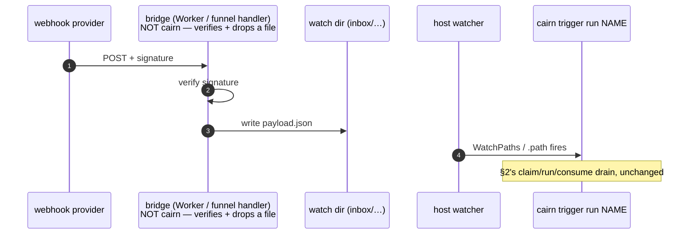

# cairn — Event triggers

First-class event-fired runs — **without a listener.** cairn does not own a socket, a
webhook receiver, or a resident watch process — the host's own file-watch facility
(launchd `WatchPaths`, systemd `.path` units) fires `cairn trigger run <name>`, exactly
as the host clock fires `cairn schedule run <name>` ([SCHEDULING.md](SCHEDULING.md)):
`schedule` : cron/launchd timers :: `trigger` : WatchPaths / systemd path-units. An event
is a file — a JSON payload dropped into a watched inbox directory — so the filesystem
stays the one authority; nothing here parses HTTP or holds a socket open.

> **Status: LIVE — built and tested.** `triggers.yaml`, the `cairn trigger`
> sync/list/remove/run verb, both host backends (launchd/systemd; cron refuses with the
> documented poll fallback below), the claim/consume at-most-once engine, and the
> `cursor:` poll-source primitive on `run:` steps are all shipped and covered by the unit
> suite. §5's webhook bridge is a documented pattern, not code — it ships nowhere in the
> kernel and never will (§6).

---

## 1. Declared triggers — `triggers.yaml`

Triggers are workspace data, committed and reviewed like everything else — a sibling of
`schedules.yaml` at the workspace root:

```yaml
# triggers.yaml
handle-reply:
  pipeline: handle-reply          # must exist in pipelines/ (checked at parse time)
  watch: inbox/replies/           # workspace-relative dir; one run per new top-level file
  # optional:
  param: event                    # default "event" — the claimed file's absolute path
                                   # arrives as --param event=<path>
  glob: "*.json"                  # default "*" — dotfiles and subdirectories are always
                                   # ignored regardless of the glob
  on_done: done                   # default "done" — see the table below
```

| Key | Type | Default | Meaning |
|---|---|---|---|
| `pipeline` | string | *required* | must exist at `pipelines/<pipeline>.yaml` (checked at load time) |
| `watch` | string | *required* | workspace-relative directory; must resolve inside the workspace (a symlink escape is a `ConfigError`, not a silent read outside it) |
| `param` | string | `event` | the claimed file's absolute path arrives as `--param <param>=<path>` on the child `cairn run` |
| `glob` | string | `*` | top-level match only — never recurses; dotfiles/dot-dirs (`.claim/`, `.done/`, `.failed/`) are always excluded from the scan, independent of the glob |
| `on_done` | `done` \| `delete` | `done` | `done` moves the consumed file to `<watch>/.done/`; `delete` removes it |

**A failed run always moves the claim to `<watch>/.failed/` — there is no `on_fail:`
knob.** A poison event is never retried automatically (§2); this is unconditional by
design, not a policy an entry can weaken.

Trigger names are slug-validated (`^[A-Za-z0-9][A-Za-z0-9_-]*$`) at load time — the same
charset schedule names are held to — because a name becomes part of a rendered
`launchd`/`systemd` unit identity (§3); anything outside that charset is a `ConfigError`
naming the trigger and the offending value, not a silently-mangled filename.

## 2. `cairn trigger run <name>` — the fired entry, at-most-once

The host watcher fires on *any* watched-dir mutation and may coalesce or duplicate
firings (including the trigger's own `.claim/`/`.done/`/`.failed/` renames), so the entry
point — not the watcher — owns dedupe:

```mermaid
sequenceDiagram
    autonumber
    participant Src as event source<br/>(script, webhook bridge, human)
    participant W as watch dir<br/>(inbox/…)
    participant Host as host watcher<br/>(launchd WatchPaths / systemd .path)
    participant CLI as cairn trigger run NAME
    participant Claim as .claim/
    participant Run as cairn run PIPELINE --headless<br/>--param PARAM=&lt;claimed-path&gt;
    participant Out as .done/ or .failed/

    Src->>W: drop event.json
    Host->>CLI: fires on ANY dir mutation<br/>(may coalesce or duplicate)
    CLI->>W: scan top-level files matching glob
    CLI->>Claim: atomic hard-link claim<br/>(a losing race → skip, never an error)
    CLI->>Run: exec once per claimed file
    Run-->>CLI: exit code
    alt exit 0
        CLI->>Out: consume → .done/ (or delete, per on_done)
    else exit nonzero
        CLI->>Out: consume → .failed/ (never retried)
    end
    Note over Claim,Out: a crash mid-run leaves the file in .claim/ — surfaced as<br/>"stuck" by `cairn trigger list`, never auto-retried
```

Two concurrent firings racing for the same file resolve to **at most one** claim: the
loser's atomic claim attempt returns "lost the race," not an error, and it simply skips
that candidate. `cairn trigger run <name>`'s exit code reflects the whole drain, not just
child exit codes: it is **nonzero when any candidate failed to process** — a claimed
file's child exiting nonzero, **or** the claim/spawn/consume step itself hazarding (a
filesystem or platform fault) — and **0** when every candidate processed clean, including
the empty-scan case (nothing to do is a successful no-op). A failure never stops the
drain — every remaining candidate is still claimed and run.

A claim whose child never ran (a spawn or consume-time hazard, not a poison event) is
left in `.claim/` as a **stuck claim** — surfaced by `cairn trigger list`, never
auto-retried; an operator re-drops or discards it by hand. This is deliberate: a claim
with no recorded outcome has no known result to safely retry.

A run minted from an event embeds the claimed filename in its `run_id` the normal way
(`{params.event}` is a path; author `run_id: "reply-{date}-…"` alongside the payload).

## 3. `cairn trigger sync|list|remove|run` — install into the host watcher

Mirrors `cairn schedule` exactly: render-only functions plus Runner-injected effects,
same managed-block/label conventions so a schedule and a trigger sharing a name can never
collide on host-scheduler identity.

```
cairn trigger sync [--backend cron|launchd|systemd] [--launchd-dir P] [--systemd-dir P]
           [--workspace .]                      # install/update/prune every declared
                                                 # trigger into the host watcher; a repeated
                                                 # sync of byte-identical rendered output
                                                 # issues ZERO host-watcher calls — a true
                                                 # no-op, not merely an unchanged file
cairn trigger list [--backend ...] [--json]      # declared vs installed vs stuck-claim diff
cairn trigger remove <name> [--backend ...]      # remove one trigger's unit/plist file(s);
                                                 # idempotent — a re-run reports nothing to do
cairn trigger run <name> [--workspace .] [--headless]  # drain the inbox now — also what the
                                                 # installed host unit calls when it fires
                                                 # (--headless is accepted and ignored —
                                                 # present only so the §3 cron-fallback
                                                 # entry below is copy-paste runnable)
```

**Default backend is `cron`** (mirroring `schedule`'s literal default), but cron **always
refuses** for triggers — there is no cron file-watch facility — on `sync`, `list`, and
`remove` alike, so pass `--backend launchd` or `--backend systemd` explicitly. The
refusal names the documented fallback: a `schedules.yaml` entry that polls the inbox
every few minutes via `cairn trigger run <name>` (idempotent and cheap against an empty
inbox), installed with `cairn schedule install --backend cron`. `schedule`'s own
`_ALLOWED_VERBS` recognizes `trigger` for exactly this purpose, with the same
non-interactive exemption `gc` gets — a fired trigger's own child run is already
`--headless` by construction, so nothing on that argv needs to force it.

**Writes never touch a file they don't own.** `sync`/`remove` read back an existing
target file's own rendered content (not its filename) to classify it as ours, a
schedule's, or unmanaged, before writing or deleting anything at that stem — closing the
same-stem collision a schedule named `trigger-X` and a trigger named `X` would otherwise
create. An ownership conflict is a loud `ConfigError`, never a silent overwrite or delete.

Target dirs default to `~/Library/LaunchAgents` (launchd) and `~/.config/systemd/user`
(systemd), overridable with `--launchd-dir`/`--systemd-dir` — identical to `schedule`.

## 4. Poll source with a persistent cursor

The piece a pure inbox-watch can't cover: a provider with no push mechanism, only a
"give me everything since X" poll endpoint. A `cursor:` option on a `run:` step gives
that step a kernel-managed watermark that outlives any single run:

```yaml
- step: poll-resend
  run: "scripts/poll-resend {cursor.value} {cursor.next} inbox/replies/"
  cursor: state/resend-cursor.json     # workspace-relative; validated at plan time
                                        # (no absolute path, no `..` escape; run: steps only —
                                        # agent:/manual: steps reject cursor: at parse time)
  produces: [poll-report]
```

- `{cursor.value}` renders the current committed watermark (`""` on the first run ever,
  or whenever nothing has committed yet).
- `{cursor.next}` renders a kernel-chosen scratch path (`<run_dir>/.cairn/cursor-next-<step_id>`)
  the step writes its candidate new watermark to.
- The kernel commits `next` → the cursor file **only after the step's `produces`
  validate AND its exit code is 0** — a failed or halted poll never advances the
  watermark, so the next firing re-fetches from the same point.
- **A missing or blank scratch file is not an error** — no advance, nothing written,
  nothing logged. **An unchanged candidate is a true no-op** — no rewrite, no trail
  event. **Unreadable/non-UTF-8 scratch content** (the step's own command wrote garbage)
  does not fail the already-successful step either, but it is not silently swallowed:
  cairn prints `cairn: warning — step '<id>': cursor scratch unreadable (…); cursor not
  advanced` to stderr, and the same signal rides along in that step's `step-done` trail
  event as `cursor_warning` — no new trail-event kind for it.
- A real commit fires exactly one `cursor-commit` trail event: `{node: <step_id>, data:
  {path: <cursor path>, value: <new watermark>}}`.
- The commit itself is atomic (fsync + `os.replace`, the same durability shape
  `runstate.py` uses for `run.json`) and guarded by a **blocking** `flock` on a companion
  `.lock` file next to the cursor file — two concurrently scheduled polls both eventually
  commit in turn rather than one failing fast, since a scheduled poll has no human to
  retry it.

Paired with `schedules.yaml` (a `*/5 * * * *` poll), this covers most "webhook" needs
with zero public surface, and upgrades cleanly to §2/§3 triggers the moment the provider
can push instead of only answering polls.

*Not currently built:* `cairn plan` does not warn when a `cursor:` step is unreachable
from any schedule or trigger — a possible future addition, not present behavior today.

## 5. Webhook bridge — a documented edge pattern, not a kernel feature

Most providers only push, never poll — but a webhook receiver is a resident network
service, which is exactly what cairn's doctrine (§0) refuses to own. The pattern: run a
tiny, separately-deployed bridge (a Cloudflare Worker, a `tailscale funnel` + a few lines
of handler code — anything that can hold a socket open and verify a signature) that:

1. verifies the provider's request signature (HMAC, JWT, whatever the provider requires);
2. writes the JSON payload as one file into the trigger's watched inbox — over
   `rsync`/an object-store sync/a `git push` to a repo the workspace pulls, any transport
   that ends in "a file lands in `watch:`";
3. does nothing else. No business logic, no cairn awareness beyond the file drop.



Explicitly **not** a kernel feature: no TLS termination, no signature-verification
library, no auth surface, and no new dependency ships in cairn for this. The bridge is
infrastructure the operator owns and deploys next to (not inside) the workspace; cairn's
only contract with it is "a file appears in the watched directory."

## 6. Non-features, named

No daemon, no listener socket, no built-in webhook receiver or signature verification (§5
is a pattern, not code), no cron-expression evaluation for triggers (cron cannot host one
at all — §3), no retry loop for a poison event (`.failed/` plus the stuck-claim surfacing
in `cairn trigger list` *is* the retry policy — an operator re-drops it by hand), and no
multi-file transactional claims — one file is one claim is one run, always.
